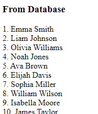
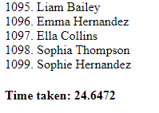
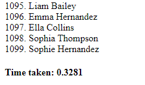

# Project: Assignment 3, COMP 3015: Database Caching

## Project Overview

This repository hosts a demonstration project aimed at showcasing the benefits of database caching using Redis.

The project consists of:

- **Application:** A sample web application that interacts with a database to fetch data.
- **Caching Mechanism:** Integration of Redis as a caching layer to store and retrieve frequently accessed data.
- **Latency Comparison:** A comprehensive analysis of latency reduction achieved by fetching data from Redis cache compared to direct database queries.

## Setup for Windows

- [Download and install redis for windows](https://github.com/microsoftarchive/redis/releases/tag/win-3.2.100)
- Open the _Command Prompt_ and run `redis-cli` to start redis client.
- To ensure that the Redis client is running, type `ping` and press Enter. If the client is running properly, you should receive a response of "PONG."
- Clone the project.
- Ensure you create the database schema with the `schema.sql` file. The credentials for the database can be added within the `index.php` file ( line 23 ).
- This application requires data in the database. You have two options for populating the database:
  - Manually add data to the database ( at least 100 entries ).
  - Automatically fill up the database by running the `read_names.php` script. Don't forget to input your own database credentials in line 3 of the script.

## Install dependencies

- This project require Node.js. [How to install](https://www.knowledgehut.com/blog/web-development/install-node-js-and-npm).
- Access the project folder in the [Visual Studio Code](https://code.visualstudio.com/) terminal, and run `npm install`, then `composer install`.

## Running the application

You can run the application using the built-in PHP web server:

```
php -S localhost:7777
```

## App Functionality Overview

**Initial Database Query:** Upon the first request, the app retrieves and displays all first and last names from the database. The time taken to fetch this data is shown at the bottom of the page.
**Subsequent Requests:** For subsequent requests, data is fetched from cache memory. The time taken for this retrieval is also displayed at the bottom of the page, allowing for comparison of efficiency between database and cache retrieval methods.

## Screenshots

- #### Fetching data from the database

  
  

- #### Fetching data from the cache memory
  
  

### References

- [Installing Redis on Windows & integrating it with PHP](https://www.youtube.com/watch?v=ioCaSHNhIJA)
- [Caching Mysql Query Responses in Redis using PHP](https://www.youtube.com/watch?v=YLqd7cQxap8)

#### LICENCE

https://choosealicense.com/
